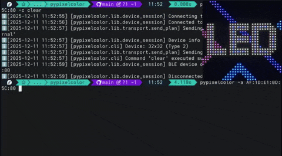

# Commands

## `clear`

::: pypixelcolor.commands.clear.clear
    options:
      show_root_heading: false
      show_root_toc_entry: false

## `delete`

::: pypixelcolor.commands.delete.delete
    options:
      show_root_heading: false
      show_root_toc_entry: false

## `send_image`

::: pypixelcolor.commands.send_image.send_image
    options:
      show_root_heading: false
      show_root_toc_entry: false

## `send_image_hex`

::: pypixelcolor.commands.send_image.send_image_hex
    options:
      show_root_heading: false
      show_root_toc_entry: false

## `send_text`

::: pypixelcolor.commands.send_text.send_text
    options:
      show_root_heading: false
      show_root_toc_entry: false

## `set_brightness`

::: pypixelcolor.commands.set_brightness.set_brightness
    options:
      show_root_heading: false
      show_root_toc_entry: false

## `set_clock_mode`

::: pypixelcolor.commands.set_clock_mode.set_clock_mode
    options:
      show_root_heading: false
      show_root_toc_entry: false

## `set_fun_mode`

::: pypixelcolor.commands.set_fun_mode.set_fun_mode
    options:
      show_root_heading: false
      show_root_toc_entry: false

## `set_pixel`

::: pypixelcolor.commands.set_fun_mode.set_pixel
    options:
      show_root_heading: false
      show_root_toc_entry: false

## `set_orientation`

::: pypixelcolor.commands.set_orientation.set_orientation
    options:
      show_root_heading: false
      show_root_toc_entry: false

## `set_power`

::: pypixelcolor.commands.set_power.set_power
    options:
      show_root_heading: false
      show_root_toc_entry: false

## `set_rhythm_mode`

::: pypixelcolor.commands.set_rhythm_mode.set_rhythm_mode
    options:
      show_root_heading: false
      show_root_toc_entry: false

## `set_time`

::: pypixelcolor.commands.set_time.set_time
    options:
      show_root_heading: false
      show_root_toc_entry: false

## `show_slot`

::: pypixelcolor.commands.show_slot.show_slot
    options:
      show_root_heading: false
      show_root_toc_entry: false
